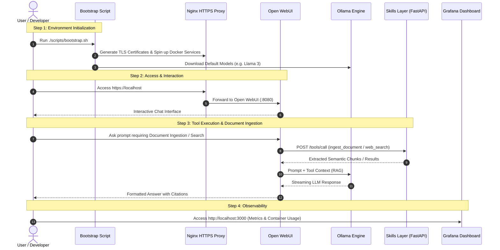

# Project A.R.K. (Autonomous AI Resource Kernel)

Project A.R.K. is a robust, production-ready containerized ecosystem integrating **Ollama**, **Open WebUI**, an **Nginx Reverse Proxy**, a **Modular Python Skills Layer**, and a full **Monitoring & Observability Stack** (Prometheus, Grafana, cAdvisor) for secure, local LLM execution and extension.

---

## 📐 Architecture & Topology

Project A.R.K. follows strict security and containerization principles:
- **Network Isolation**: Ollama (`11434`) is restricted to the internal container bridge network (`ark_network`) and is not directly accessible from the host OS.
- **TLS Termination**: Nginx acts as the single entry point, securing traffic via HTTPS (ports `443` / `8443`) and proxying to Open WebUI (`8080`).
- **Modular Extensibility**: A FastAPI-based Skills Layer executes background tools (web search, filesystem reads, advanced document ingestion/chunking, code quality analysis).
- **Full Observability**: Live metrics are ingested from cAdvisor into Prometheus and visualized via pre-configured Grafana dashboards.

### System Architecture Diagram (Mermaid)

```mermaid
flowchart TB
    subgraph Host OS / User
        User[Client Browser / Dev]
    end

    subgraph Security Layer
        Nginx[Nginx Reverse Proxy<br/>HTTPS :443 / :8443]
    end

    subgraph Container Network (ark_network)
        WebUI[Open WebUI<br/>Port :8080]
        Ollama[Ollama LLM Engine<br/>Port :11434 - Internal Only]
        Skills[Modular Skills Layer<br/>FastAPI :8001 / :8000]
    end

    subgraph Monitoring Stack
        cAdvisor[cAdvisor<br/>Port :8082]
        Prometheus[Prometheus TSDB<br/>Port :9090]
        Grafana[Grafana Dashboard<br/>Port :3000]
    end

    %% User Connections
    User -->|HTTPS :443 / :8443| Nginx
    User -->|HTTP :3000| Grafana
    User -->|HTTP :9090| Prometheus

    %% Reverse Proxy Routing
    Nginx -->|HTTP Internal| WebUI

    %% WebUI Integration
    WebUI -->|Internal API| Ollama
    WebUI -->|HTTP Tool Call :8001| Skills

    %% Observability Scraping
    cAdvisor -->|Container Metrics| Prometheus
    Prometheus -->|Data Source| Grafana
```

---

## 🧭 User & Developer Journey ("Jornada de Uso")



### Detailed Journey Steps:
1. **Environment Setup & Bootstrapping**:
   - Running `./scripts/bootstrap.sh` (or `.\scripts\bootstrap.ps1` on Windows) automatically generates local TLS certificates in `./certs/`, initializes all 6 core services via `docker-compose`, and pulls initial LLM weights into Ollama.
2. **Interactive AI Conversations**:
   - Users navigate to `https://localhost`, accept the local dev TLS certificate, and interact with models running entirely on local hardware.
3. **Advanced Tool & RAG Execution**:
   - Open WebUI sends requests to the FastAPI Skills Layer at `http://skills:8000/tools/call`.
   - The Skills Layer supports PDF/Text document ingestion (`ingest_document`), code static analysis (`code_quality_analyzer.py`), and web search mocking.
4. **Monitoring & Performance Tuning**:
   - Engineers view real-time CPU, memory, network, and container metrics via Grafana (`http://localhost:3000`) backed by Prometheus and cAdvisor.

---

## 🛠️ Components Breakdown

| Service | Container Name | Port Exposure | Description |
| :--- | :--- | :--- | :--- |
| **Nginx** | `nginx` | `:443`, `:8443` | Reverse proxy enforcing TLS/SSL and routing external traffic to Open WebUI. |
| **Open WebUI** | `open-webui` | Internal (`:8080`) | Modern Web UI for LLM chats, prompt templates, RAG document handling, and tool integrations. |
| **Ollama** | `ollama` | Internal (`:11434`) | High-performance local LLM engine executing open-source models (e.g., Llama 3). |
| **Skills Layer** | `skills` | `:8001` (Host) | FastAPI service exposing Open WebUI-compatible tool endpoints (`/tools`, `/tools/call`). |
| **cAdvisor** | `cadvisor` | `:8082` | Exports real-time container metrics (CPU, RAM, Disk I/O). |
| **Prometheus** | `prometheus` | `:9090` | Time-series database scraping cAdvisor metrics. |
| **Grafana** | `grafana` | `:3000` | Pre-configured dashboard visualizer for system health and resource consumption. |

---

## 🚀 Quickstart

### Prerequisites
- Docker and Docker Compose (or Podman and `podman-compose` for rootless execution).
- Python 3.10+ (optional, for local test execution).

### Automatic Setup (Recommended)

#### Linux / macOS
```bash
chmod +x ./scripts/bootstrap.sh
./scripts/bootstrap.sh
```

#### Windows (PowerShell)
```powershell
.\scripts\bootstrap.ps1
```

---

## ⚙️ Makefile Commands

For easy administration, convenient `make` targets are provided:

```bash
make up           # Starts all containers in detached mode
make down         # Stops all running containers
make logs         # Tails combined logs across all services
make pull-models  # Downloads default models into the Ollama container
make clean        # Teardowns containers, networks, and persistent volumes
```

---

## 📊 Observability & Monitoring

Project A.R.K. includes an out-of-the-box monitoring stack:
- **Prometheus URL**: `http://localhost:9090`
- **Grafana URL**: `http://localhost:3000` (Default login: `admin` / `admin`)
- **Dashboard Provisioning**: Automatically loads the **Container Metrics** dashboard (`monitoring/grafana/dashboards/container_metrics.json`) showing live CPU, memory usage, and container health.

---

## 📚 Project Documentation & Changelog

- **Detailed Architecture Specification**: See [`docs/architecture.md`](docs/architecture.md) for full sequence diagrams, security isolation specs, and persona models.
- **Changelog & Version History**: See [`CHANGELOG.md`](CHANGELOG.md) for release logs and feature histories.
- **Delivery Epics**: See [`delivery_epics.md`](delivery_epics.md) for roadmap progress.

---

## ❓ Troubleshooting

* **Permission Errors with Volumes (Podman/SELinux):**
  If running in a strict Podman rootless environment, ensure volumes use the `:z` flag in `docker-compose.yml` for SELinux relabeling.
* **Ollama Container Health Check Issues:**
  The healthcheck relies on `["CMD", "ollama", "list"]`. Verify container status with `make logs` if model initialization is taking time.
* **SSL Certificate Warnings:**
  Self-signed certificates are generated locally via `./scripts/generate-certs.sh`. Confirm browser exception when opening `https://localhost`.
