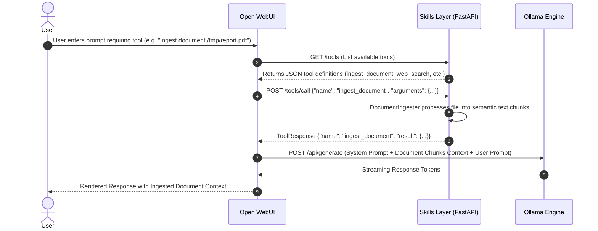
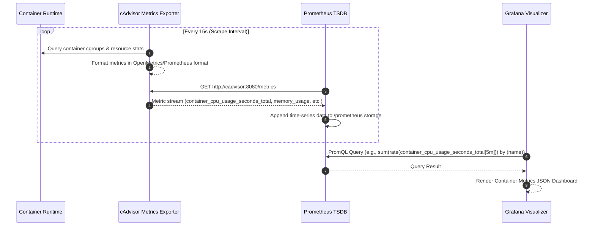

# Project A.R.K. Architectural Specification

This document presents the detailed architectural design, security model, data flows, and persona responsibilities for **Project A.R.K. (Autonomous AI Resource Kernel)**.

---

## 1. Core Architectural Principles

1. **Local & Air-Gapped Security**: All LLM processing runs locally via Ollama inside an isolated container network (`ark_network`). Port `11434` is strictly unmapped on the host machine.
2. **TLS Gateway Enforcer**: Nginx acts as the sole secure ingress point (`:443`/`:8443`), handling SSL/TLS termination and reverse proxying requests to Open WebUI (`:8080`).
3. **Modular Skill Execution**: Extensible tools (web search, filesystem access, document chunking, code static analysis) are decoupled from the core UI into a FastAPI Skills Layer (`skills:8000`).
4. **Rootless Podman & Docker Compatibility**: Volume mounts utilize `:z` flags for SELinux relabeling, and healthchecks avoid non-standard binaries.
5. **Native Observability**: Resource usage (CPU, Memory, Network, Disk) is monitored via cAdvisor, collected by Prometheus, and visualized via Grafana.

---

## 2. Service Topology & Network Isolation

```mermaid
graph TD
    subgraph Host Network Boundary
        ClientBrowser[Client Web Browser / API Client]
        HostOS[Host OS Services]
    end

    subgraph External Exposed Ports
        PortHTTPS[Port 443 / 8443 HTTPS]
        PortGrafana[Port 3000 HTTP]
        PortPrometheus[Port 9090 HTTP]
        PortSkills[Port 8001 HTTP]
    end

    subgraph Internal Container Network (ark_network)
        Nginx[Nginx Reverse Proxy]
        WebUI[Open WebUI Container]
        Ollama[Ollama Container]
        SkillsContainer[Modular Skills Container]
        cAdvisor[cAdvisor Container]
        Prometheus[Prometheus Container]
        Grafana[Grafana Container]
    end

    ClientBrowser --> PortHTTPS --> Nginx
    ClientBrowser --> PortGrafana --> Grafana
    ClientBrowser --> PortPrometheus --> Prometheus
    HostOS --> PortSkills --> SkillsContainer

    Nginx -->|Proxy Pass HTTP :8080| WebUI
    WebUI -->|HTTP :11434| Ollama
    WebUI -->|HTTP :8000| SkillsContainer

    cAdvisor -->|Scrape Metrics| Prometheus
    Prometheus -->|Data Source| Grafana
```

---

## 3. Sequence Diagrams

### 3.1. Tool Calling Workflow (FastAPI Skills Integration)



### 3.2. Metrics Collection & Observability Workflow



---

## 4. Personas & Operational Scenarios

- **Software Architect**:
  - *Responsibilities*: Defines overall container architecture, security boundaries, and RAG schemas.
  - *Primary Tools*: `docker-compose.yml`, `nginx.conf`, `docs/architecture.md`.

- **AI Engineer / Skill Developer**:
  - *Responsibilities*: Extends local LLM capabilities by building custom tools in Python/FastAPI (`skills/`).
  - *Primary Tools*: `skills/main.py`, `skills/document_ingester.py`, `skills/code_quality_analyzer.py`.

- **DevOps / System Administrator**:
  - *Responsibilities*: Maintains local container infrastructure, ensures zero external data leakage, and monitors hardware resource consumption (RAM, CPU, VRAM).
  - *Primary Tools*: `scripts/bootstrap.sh`, Grafana (`http://localhost:3000`), Prometheus (`http://localhost:9090`).

- **End User / Analyst**:
  - *Responsibilities*: Leverages local LLMs for private document ingestion, code analysis, and conversational AI without third-party API exposure.
  - *Primary Tools*: Open WebUI (`https://localhost`).
